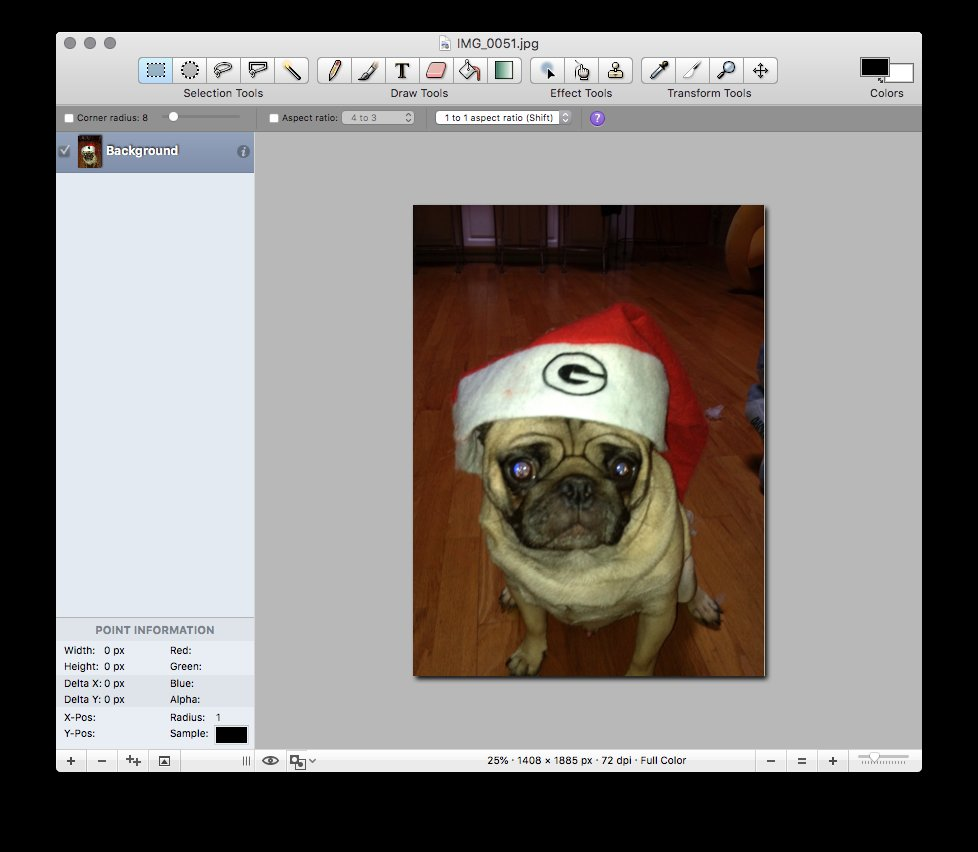
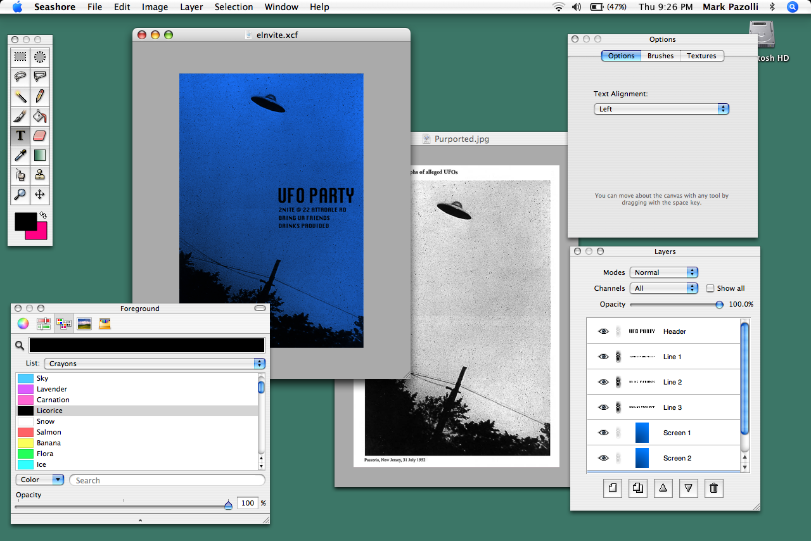

# seashore

Seashore is now on the App Store !!! If you add your positive review there, it will do wonders for the proliferation of Seashore.

You can also download the latest DMG releases [here](https://github.com/robaho/seashore/releases), but these will no longer perform "update checks" - since this requires the App Store.

**The current version requires 10.7+. If you are on an earlier OSX version, I suggest downloading the 0.6.6 binaries from seashore.sourceforge.net. Most likely you need to download the "hfs" version in order to open on an older Mac.**

Seashore was originally located at https://sourceforge.net/p/seashore

This is the currently maintained version. The primary motivation was to allow Seashore to work on OSX 10.6+, including Sierra, and El Capitan, and so this originally only contained bug fixes.

Beyond the bug fixes, a lot of code refactoring was performed, including converted the application to ARC. Additionally, a few minor enhancements have been added.

If you are looking for an free, easy to use, image editing application with "layers", this is the one.

# screenshots

