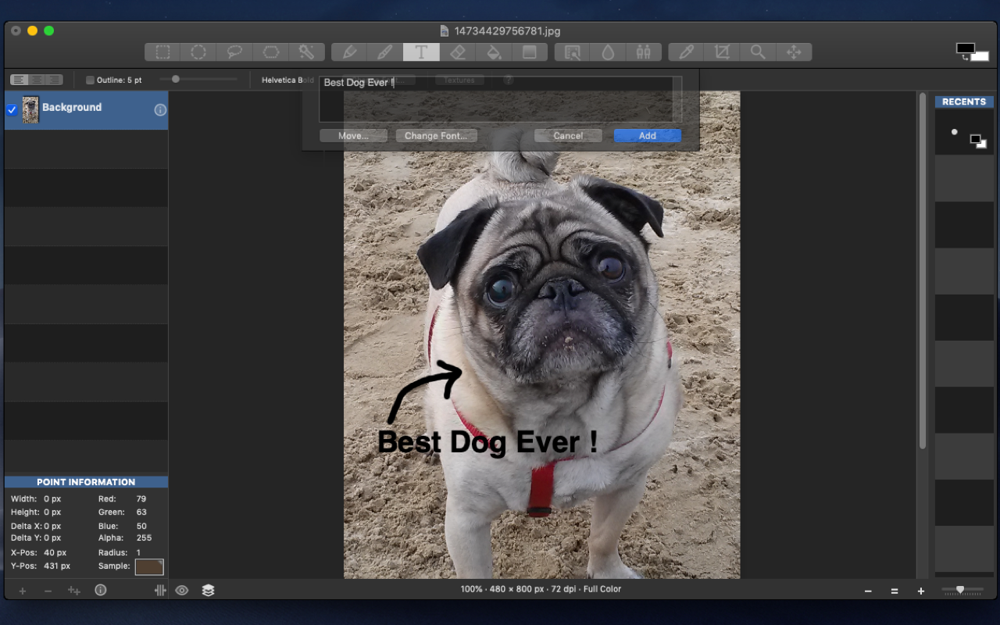
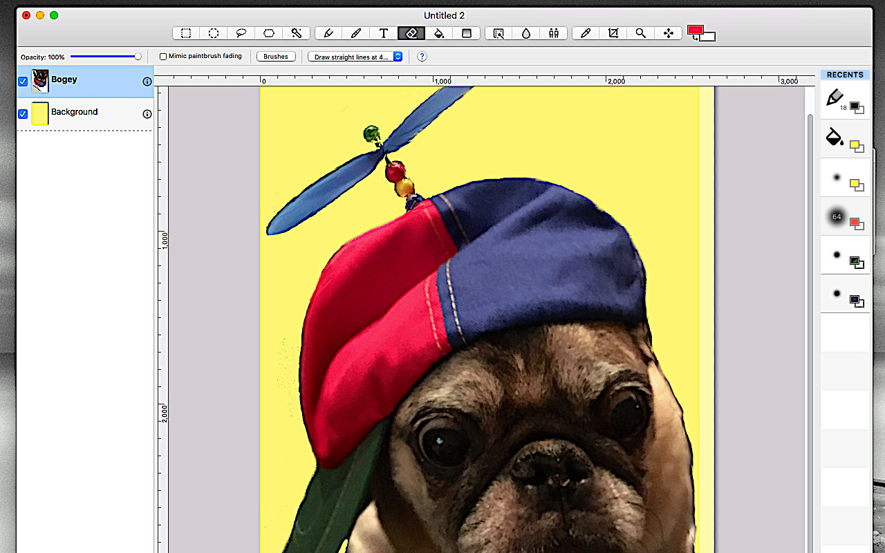
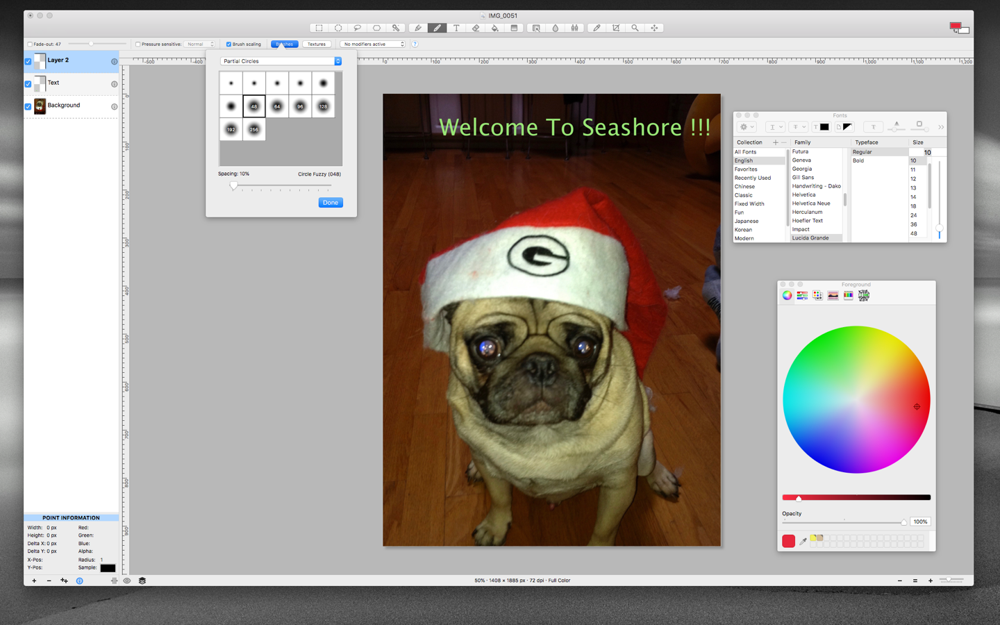
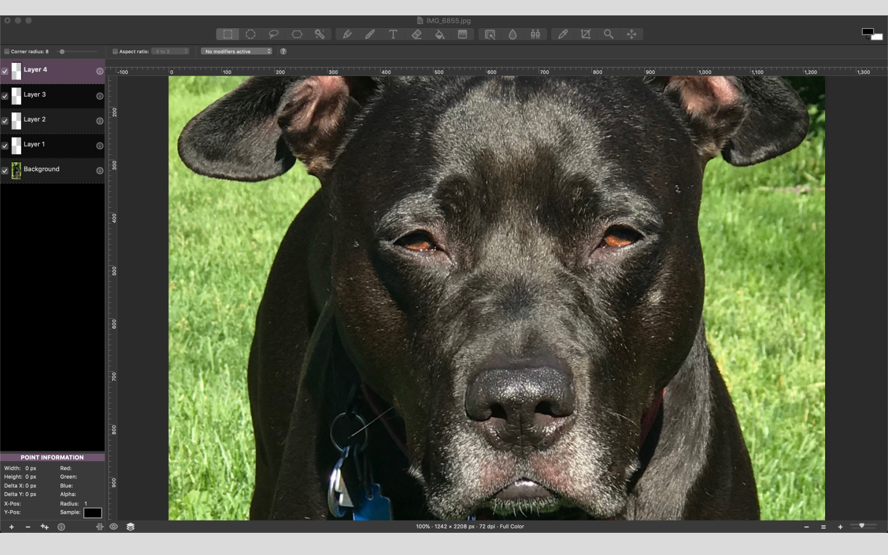

# seashore

Seashore is now on the App Store !!! Please add your positive review/rating ther (I believe people are trying to tank the project by posting clearly incorrect reviews). Also, if you use it for your website, business, whatever, giving credit to Seashore and a link to the App Store will go a long way towards making the project survive and prosper.

If you'd like to offer monetary assistance to the project, please donate here 

You can also download the latest DMG releases [here](https://github.com/robaho/seashore/releases), **but these will no longer perform "update checks"** - since this requires the App Store - so you will need to periodically check for new releases !

**The current version requires 10.7+. If you are on an earlier OSX version, I suggest downloading the 0.6.6 binaries from seashore.sourceforge.net. Most likely you need to download the "hfs" version in order to open on an older Mac.**

Seashore was originally located at https://sourceforge.net/p/seashore and was the brainchild of Mark Pazolli.

This is the currently maintained version. The primary motivation was to allow Seashore to work on OSX 10.6+, including Sierra, and El Capitan, and so this originally only contained bug fixes.

Beyond the bug fixes, a lot of code refactoring was performed, including converting the application to ARC.

As of late, more enhancements have been added, like the UI refresh, and Mojave "dark mode" support.

If you are looking for an free, easy to use, image editing application with "layers", this is the one.

Here's a nice article (with screenshots) on the Seashore project at [Libre Graphics World](http://libregraphicsworld.org/blog/entry/meet-seashore-free-image-editor-for-macos)

# screenshots

